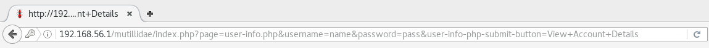

# Lab1: Using sqlmap#

----------

1. Open Firefox (`<ALT>+<F2>`) and navigate to *Mutillidae* app (host_ip/mutillidae/)

    

2. In navigation menu on the left, navigate to *OWASP 2013 > A1 - Injection(SQL) > SQLMAP Practice > User info (SQL)*

    

3. Enter random username and password and click **View Account Details**

4. *Authentication Error* will pop up, but also *GET* request will appear in navigation bar

    

5. Open virtual console
6. Open *SQLmap* help to display basic commands: `sqlmap -h` and press `<enter>`

7. Enter `sqlmap -u <get-request> -p <test-parameter>`, and press `<enter>`(if asked for additional test inclusions, press `<enter>` to continue). **NOTE**: copy complete *GET* request (step 4.) from navigation bar.

    
	Results are listed below with information if specified parameter is vulnerable to SQL attack.

8. To fetch database names add `--dbs` to the end of previous command `sqlmap -u <get-request> -p <test-parameter> --dbs` and execute

9. To fetch table names from specific database use following command `sqlmap -u <get-request> -p <test-parameter> -D <database-name> --tables` and execute

10. To fetch column names from specific table, from specific database, use following command `sqlmap -u <get-request> -p <test-parameter> -D <database-name> -T <table-name> --columns` and execute

[Back to the Main page](README.md "Main page")