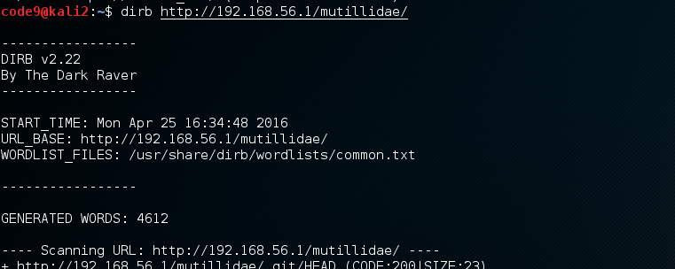

# Lab2: Using dirb#

----------

1. Start virtuel console
2. Enter `dirb` and press `<enter>` for options and commands
3. Enter `dirb <host-ip>/mutilidae` for path traversal attack on Mutilidae app

    

[Back to the Main page](README.md "Main page")