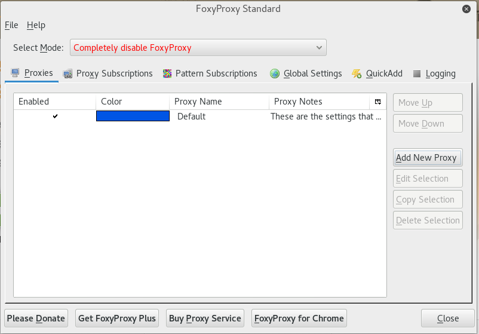
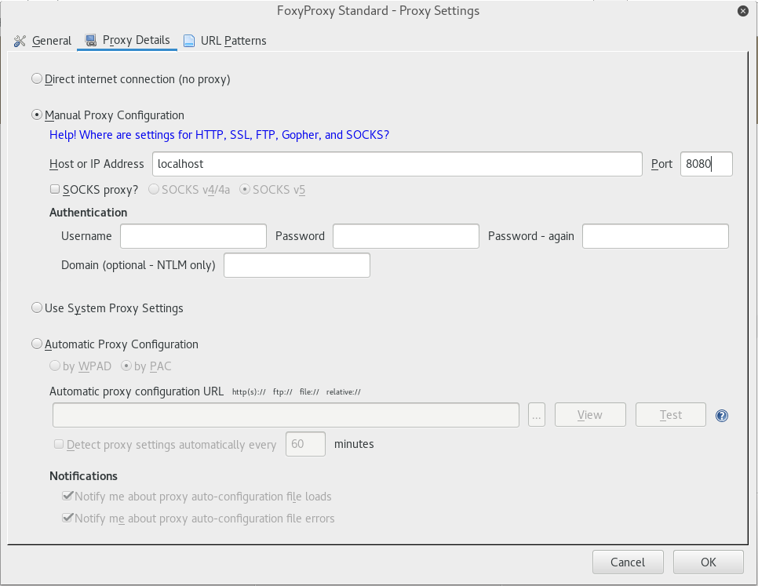
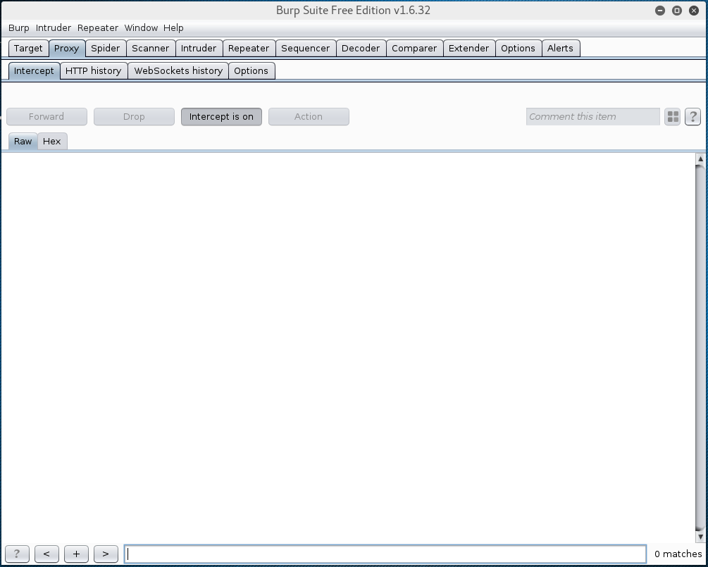
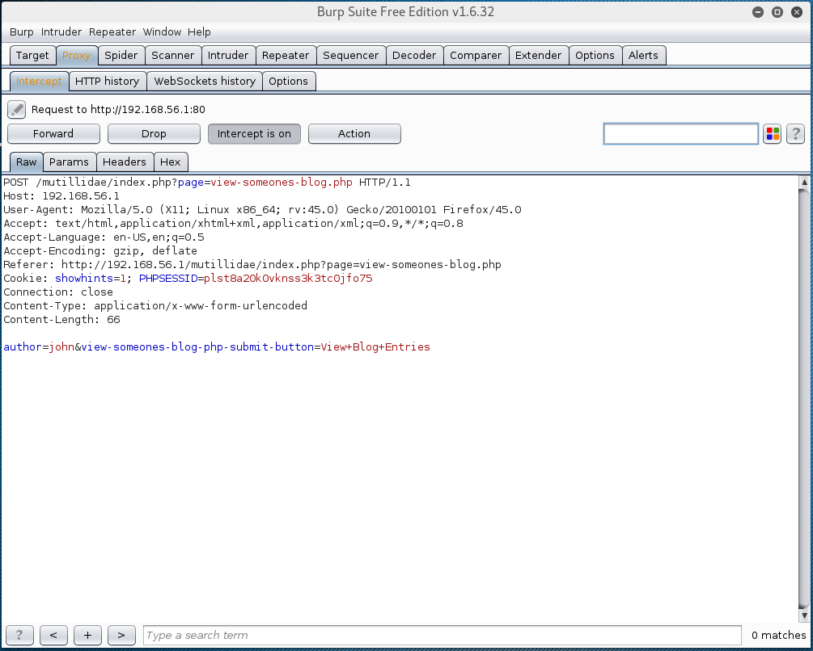
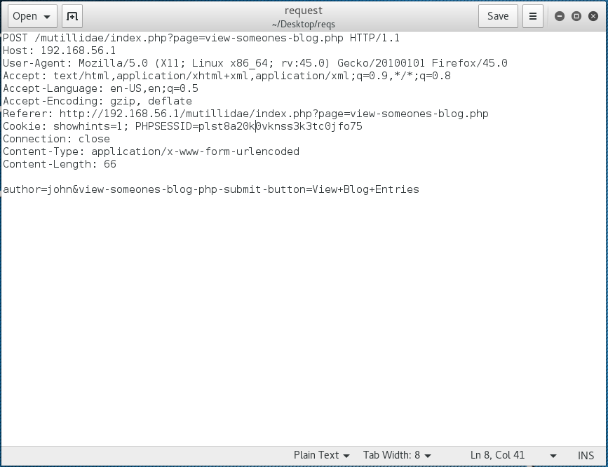
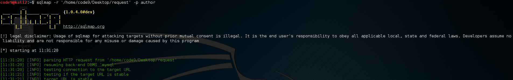
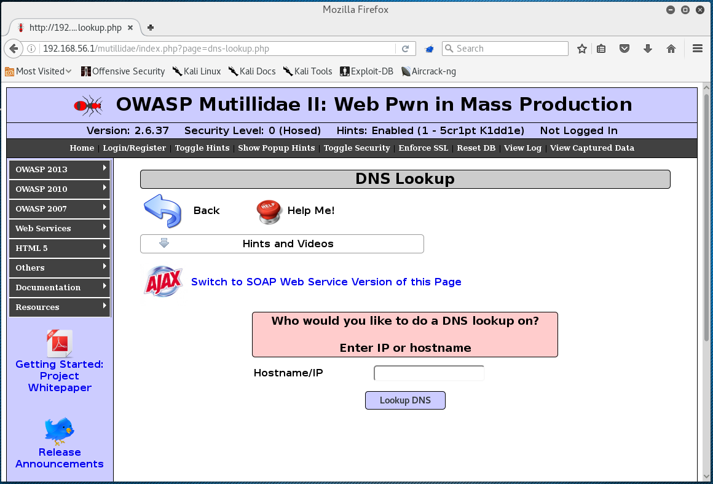
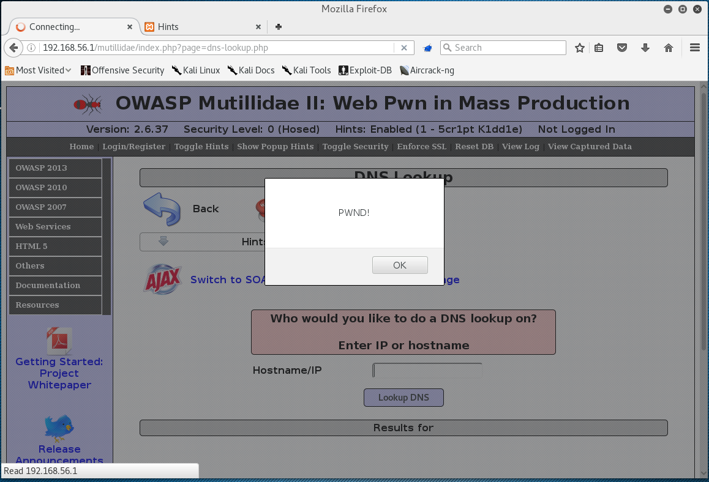

# Lab 3: Performing different injections (xss + sql) using burpsuite#

## 1. Set up FoxyProxy##
1. Click on FoxyProxy icon on Firefox toolbar to open
2. Click on **Add New Proxy**

    

3. On **General** tab, enter name for new proxy, and choose color(optional)
5. On **Proxy Details** tab, *Host or IP address* : **localhost** , *Port* : **8080**
6. Click **OK** to confirm

    

7. On main window, *Select mode* : **Use proxy "new-proxy-name" for all URLs**, and close (FoxyProxy icon on FireFox toolbar will be colored in color picked up earlier during creation of new proxy)

All requests and responses could be intercepted now with proxy that is running on localhost (127.0.0.1), port 8080. Proxy have to be started up on particular host.

## 2. Starting up Burpsuite##
Burpsuite's default settings are defined to run on localhost (127.0.0.1), port 8080.

1. Open Burpsuite (`<ALT>+<F2>`), if asked confirm licence agreement
2. On *Proxy* tab, sub-tab *Intercept*, make sure intercept is set **ON**

    

## 3. Intercept request with Burpsuite##
1. In navigation menu on the left, navigate to *OWASP 2013 > A1 - Injection(SQL) > SQLMAP Practice > View Someones Blog*
2. Select Author and click on **View Blog Entries**
2. Open *Burpsuite* window, tab *Proxy/Intercept*, intercepted request is displayed

    

3. Analyze intercepted request for potential vulnerable parameters
4. Save intercepted request to a file (right-click somewhere in burpsuite's request window, *Copy to file*, enter name of the file and click **Save**)

    

## 4. SQLmap scan##
1. Open virtual console
2. Open *SQLmap* help to display basic commands: `sqlmap -h` and press `<enter>`
3. To scan saved request, with specific parameter execute command `sqlmap -r '<path-to-request-file>' -p <parameter-name>` (if asked for additional test inclusions, press `<enter>` to continue)

    

	Results are listed below with information if specified parameter is vulnerable to SQL attack.

4. To fetch database names add `--dbs` to the end of previous command `sqlmap -r '<path-to-request-file>' -p <parameter-name> --dbs` and execute

5. To fetch table names from specific database use following command `sqlmap -r '<path-to-request-file>' -p <parameter-name> -D <database-name> --tables` and execute
6. To fetch column names from specific table, from specific database, use following command `sqlmap -r '<path-to-request-file>' -p <parameter-name> -D <database-name> -T <table-name> --columns` and execute

## 5. XSS atack##
1. In navigation menu on the left, navigate to *OWASP 2013 > A3 - Cross Site Scripting (XSS) > Reflected (First Order0 > DNS Lokup*

    

2. Enter XSS code `<scirpt>alert("Pwnd!");</script>` into input field and click *Lookup DNS*

    

[Back to the Main page](README.md "Main page")