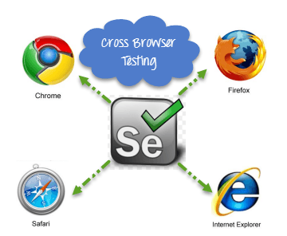
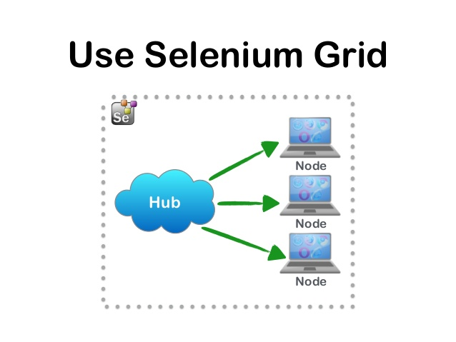
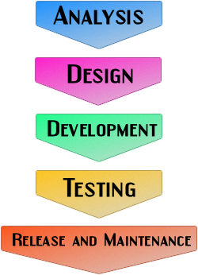
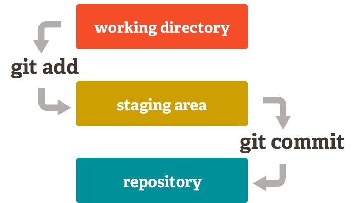
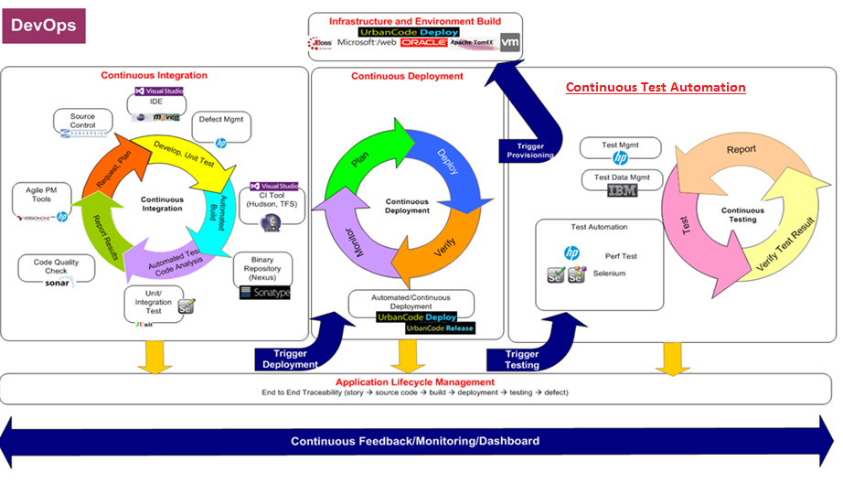
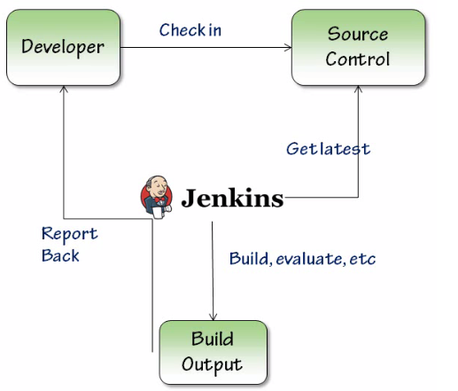
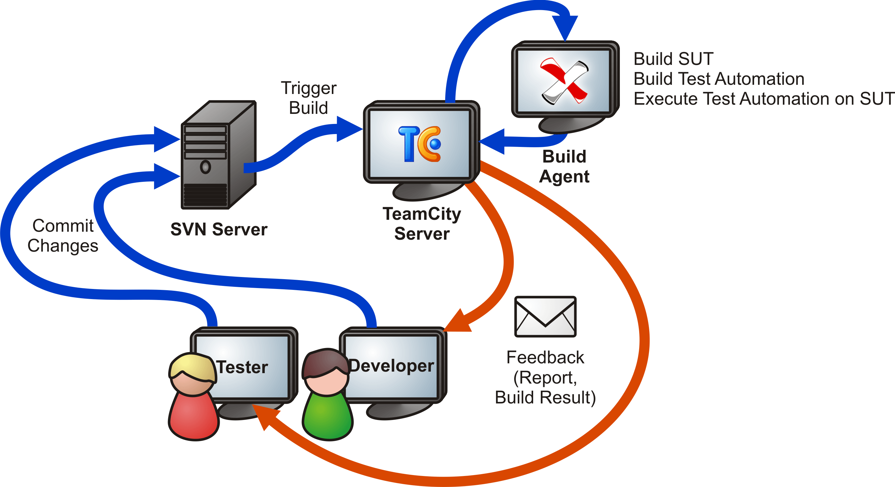

# Basic concepts #
- Running Tests via Selenium Grid
- Modern SW development

# Cross browser testing #
Selenium supports cross browser testing. Cross browser testing is a type of functional test to check that application under test works as expected in different browsers.

Using Selenium Web Driver we can automate test cases using all available browsers.

In order to achieve automatically execution tests on different browsers we are using **maven profiles**.

Task 1: Run your tests on Firefox

Setup chrome webdriver variable 

    name = webdriver.chrome.driver
    
    value = C:\path\chromedriver.exe

Task 2: Setup Maven profile and running tests.

*How to do it:*

Add remote profiles to pom file:

    <profile>
			<id>remote</id>
			<properties>
				<firefox.profile>remote-firefox</firefox.profile>
				<chrome.profile>remote-chrome</chrome.profile>
				<ie.profile>remote-internetexplorer</ie.profile>
			</properties>
	</profile>

Change @BeforeMethod in your test.

    @BeforeMethod
    @Parameters({"profile"})
    public void setUp(String profile) {
    super.setUp(profile);
    }

Add parameter in testng.xml file

    <parameter name="profile" value="${chrome.profile}" />

Run tests with next command:

    mvn clean install

# Selenium Grid #

Selenium-Grid allows you to run your tests on different machines against different browsers in parallel.

Benefits:

- Test execution on different browsers and browser versions, operating systems, etc. in the same time
- Save time in execution

**Selenium Hub**

    java -jar selenium-server-standalone-ver.jar -role hub

**Selenium Node**

    java -jar selenium-server-standalone-ver.jar -role webdriver -hub http://servername:port/grid/register -port 5555 -Dwebdriver.chrome.driver=path\chromedriver.exe

Task 3: Configure Selenium Grid on your machine.

*How to do it:*

1. Install Selenium hub using provided command
2. Register Selenium node using provided command
3. Check Selenium hub console (http://localhost:4444/grid/console)
4. Run tests on Selenium Grid (using selenium remote web driver)

`mvn clean install -Premote`

# Software Development Life Cycle #

 
# Version control software - Git #

There are two types of version control systems

**Advantages** over centralized systems:

- Performing actions other than pushing and pulling changesets is extremely fast because the tool only needs to access the hard drive, not a remote server.
- Committing new changesets can be done locally without anyone else seeing them. Once when a group of changesets is ready, it can pushed (all of them) at once.
- Everything but pushing and pulling can be done without an internet connection. 
- Since each programmer has a full copy of the project repository, they can share changes with one or two other people at a time if they want to get some feedback before showing the changes to everyone.

**Disadvantages** over centralized systems::

- If project contains many large files that cannot be easily compressed, the space needed to store all versions of these files can accumulate quickly.
- If project has a very long history, downloading the entire history can take an impractical amount of time and disk space.

**Git** is one of the most popular distributed version control systems. It has three main states that files can reside in: committed, modified and staged. 

- Committed means that data is safely stored in local database. 
- Modified means that there are changes in file but have not committed it to database. 
- Staged means the file is marked as modified in current version and ready to go into next commit snapshot. 

*How to do it:*

1. Create own repository on GitLab 
2. Push new code
3. Add new files, edit existing (work in pair)

## Continuous Delivery – automated tests as part of the deployment pipeline: ##

Continuous Delivery meaning that we are able to deploy changes to production in a continuous on the fastest possible time. To reach that we need to have:

- Continuous Integration (CI) is a development practice that requires developers to integrate code into a shared repository several times a day. 
- Continuous Deployment (CD) the time elapsed between development writing one new line of code and this new code being used by live users, in production.
- Continuous Test Automation (CT) is a practice that encourages and aligns with the overall Continuous Delivery process.

Test Automation should be done **continuously**. 

Traditionally mindset:

- only for regression
- wait until manual test cases are written and then automate them 

Continuous Test Automation mindset:

- Automation should be started even before source code exists 
- Acceptance test driven development – ATDD
- Behavior Test driven development – BDD
- Test driven development – TDD

To summarize, Continuous Test Automation encompasses all(any) of the following:

1. Continuously Test Automate
2. With rapidly changing application, Continuous Test Automation is necessary
3. Continuous Test Automation aligns with Continuous Delivery Model (CI/CD/CT)

**The benefits:**

- Test often 
- Automatic deployments
- Fast feedback
- Build quality
- Reduce cost, time and risk

# Jenkins #

Jenkins is most popular continuous integration tool. It is highly extensible open source web based java tool.

## Where Jenkins fits in ##

Allow us to organize CI flow.

### Prerequisites: ###

- Installed Java 1.5 or higher
- Java in path (optional but preferred)

Task 4: Install Jenkins, create job and execute tests via Jenkins

*How to do it?* 

# Team City #

Commercial java based software for continuous integration. 

In order to have a minimum working TeamCity suite, the user requires a TeamCity server and at least one build agent. TeamCity can be downloaded from  [TeamCity](http://www.jetbrains.com/teamcity/download/index.html)

The downloaded TeamCity bundle contains a server for a particular platform and a bunch of build agents for all supported platforms. Currently TeamCity can be installed onto Windows, Mac OS X, and Linux operating systems. 

## Build agent ##

A TeamCity Build Agent is a piece of software which listens for the commands from the TeamCity server and starts the actual build processes. It is installed and configured separately from the TeamCity server. An agent can be installed on the same computer as the server or on a different machine.

The Agent role is to checks out the source code, downloads artifacts of other builds and runs the build process. An agent can run a single build at a time. 
System requirements for build agent depends on the actual build that is expected to run on it, so hardware configuration should be chosen accordingly.  

## Server ##

The server acts as a general collector and presenter of all data generated by builds on connected build agents.
Therefore, its performance relies heavily on the number of simultaneously connected agents, the number of open web application pages, and the IDE plugin that the user is logged in to. Also, the traffic that is generated while communicating with clients described previously could yield a major bottleneck. 

## Featured TeamCity plugins ##

**Octopus Deploy plugin** creates Octopus-compatible NuGet packages and triggers Octopus Deploy deployments. TeamCity builds the code and runs tests, while Octopus takes care of:

1. Distributing applications to all the remote machines, securely
2. Environment-specific configuration, like connection strings
3. Configuring IIS sites and installing Windows Services
4. Doing all of the above across many machines in parallel

**Commit Status Publisher** Integrates TeamCity with tools like Gerrit Code Review or Atlassian Stash. When a build finishes, TeamCity will publish the build details to these code review systems.

**TeamCity Integration for JIRA** TeamCity supports JIRA out of the box: the built-in integration allows viewing JIRA issue details in the TeamCity interface.

**Microsoft Azure Cloud plugin**, allows configuring TeamCity with your Azure account and then to automatically create/start/stop/delete virtual machines with TeamCity agents 

**VMware vSphere Cloud plugin** allows using TeamCity cloud agent features with VMWare vSphere and vCenter installation. Similar to TeamCity integration with Amazon EC2 and Microsoft Azure this plugin automatically starts and stops virtual machines with TeamCity agents based on the current demand