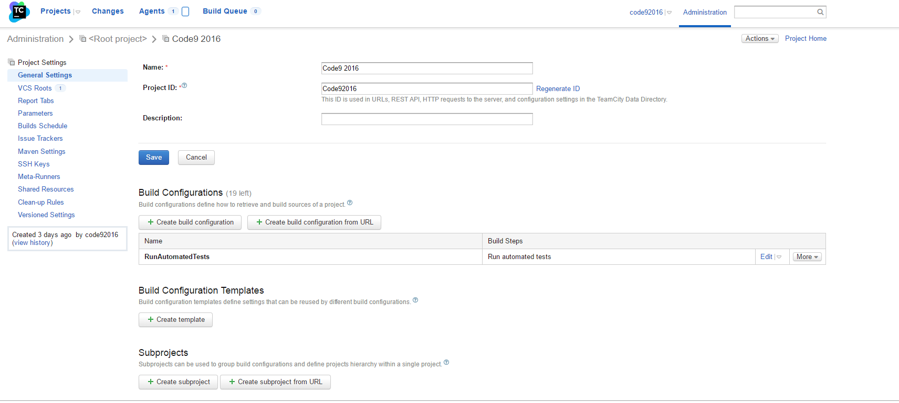
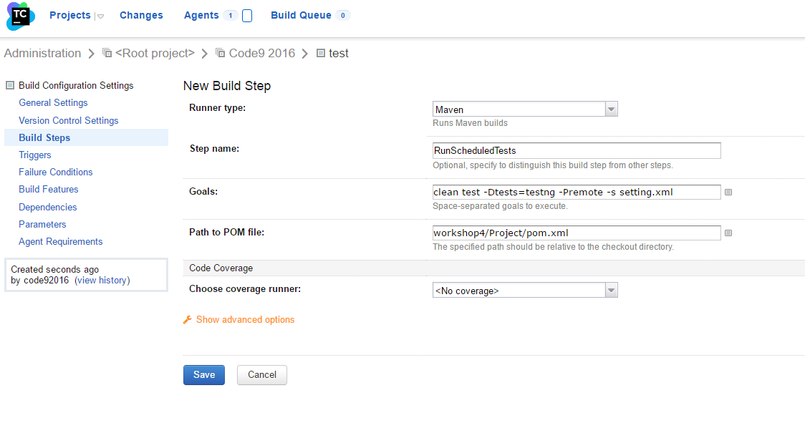
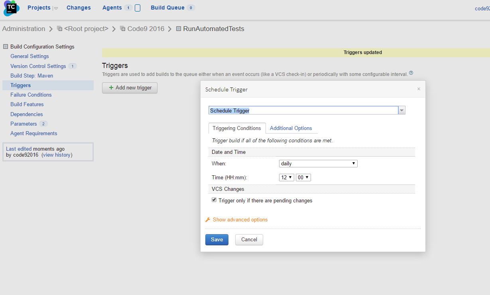

**Run existing build configuration**

	1. Check results
	2. Check build log
	3. Check diagram

**Add additional build configuration**

    1.	Browse to http://localhost:80
	2.	After some time, the server will become fully initialized 
	3.	Provide the required Username and Password values: Code92016/Code92016 
	4.	Click on Code92016 project 
	5.	Click on Edit Project Settings

	6.  Version Control Settings
	7.  Attach VCS root
	8.  Choose existing

	9. Create build configuration, fill all parameters and save
	10. Add build steps

**Add scheduled trigger for build configuration**

	1. Go to triggers
	2. Add new Schedule Trigger 
	3. Set parameters and save
	4. Check if build configuration starts at scheduled time

